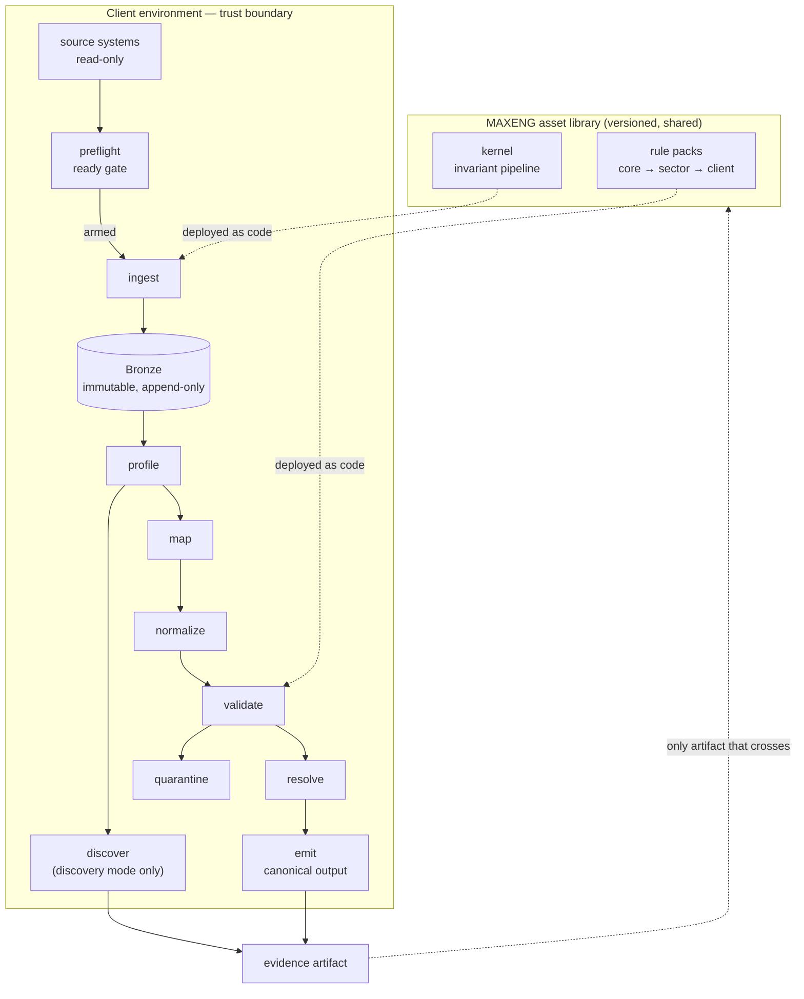

# CLAUDE.md — MAXENG Data Onboarding Harness

**Repo:** `data-onboarding-harness`
**Version:** 0.4.1 (draft)
**Status:** Pre-Gate 0
**Owner:** MAXENG
**Changelog:**
0.4.1 — **B5 — evidence/audit name collision.** §8 and §12 both said "evidence" while describing different artifacts, which made §12's per-record pre-image hash read as a direct contradiction of §8's denial of PII-typed hashes. They were never the same object. Split explicitly: the **evidence artifact** is aggregate, governed by §8, and is the only thing that crosses the boundary; the **audit record** is per-record, holds pre-image hashes, and stays inside it (§12). No keyed hashing or key management is required — the contradiction was nominal. Two further §8 corrections ride along: **field-value hashes are denied outright**, replacing a low-cardinality threshold that measured the wrong quantity (cardinality is a property of the dataset, reversibility a property of the value space), leaving only artifact-level content hashes; and the permitted list now names kernel-owned closed vocabularies explicitly, permitted because MAXENG owns the word list rather than because they are enums.
0.4.0 — **Bronze is now a core concept** (§4.2, P10): raw input is landed immutably inside the boundary and every downstream stage reads Bronze, never the source. One-shot operation is a single-batch special case of this. Closes the pre-image contradiction, makes the replay guarantee actually achievable, and fixes atomic emit (§6.3), arming modes (§6.2.3), and the Gate 1 signature metric (§13). Adds the GX result-format egress guard (§8) and the OpenRefine boundary rule (§0).
0.3.0 — added §0 agent operating rules, §6.2 source binding / preflight / arming (the ready gate), and §7.5 predicate and semantic type registries. Preflight is now the pipeline entry point; no run starts without an attributable, digest-bound approval.
0.2.0 — added the three-layer legal posture (§2.1), principle P9, recipient-side re-identification test (§8.2), external reference licensing modes (§9.6), the access model (§14.1), and the sub-processor register (§17). Driven by research into how the market actually closes the processor-status gap; §16 narrowed accordingly.
**Language convention:** This document, all code, schemas, and repo artifacts are English. Strategy discussion happens in Turkish; nothing in this repo does.

---

## 0. Agent operating rules

Read before any code change in this repository. These are imperative; the rest of the document is the reasoning behind them. If a requested change conflicts with §2, stop and say so rather than implementing it.

**Never:**

- Write a client name, brand, dealer, column name, or locale string into `kernel/`. That is always a pack or manifest concern.
- Write to a source database. Sources are read-only, no exceptions, no scratch tables, no temp objects. Output goes to the declared target only.
- Use `eval`, `exec`, or any dynamic code path for rule expressions. Predicates come from the registry in §7.5.
- Call a model outside `llm_gate`. If a stage seems to need one, it does not — raise it instead.
- Add a `--force` or `--skip-checks` flag to preflight blockers. Warnings are acknowledgeable; blockers are not.
- Generate realistic-looking Turkish identifiers in fixtures. Use documented invalid ranges: checksum-failing TCKN/VKN, reserved MSISDN blocks, non-existent province codes.
- Delete a record in any stage. Quarantine it.
- Read a source system from any stage after `ingest`. Everything downstream reads Bronze (§4.2).
- Put OpenRefine — or any interactive wrangling tool — in the delivery path. It is a discovery workstation only; its operation history compiles into a draft pack, and the pack is what executes.
- Add a field to the evidence schema without updating the §8 allowlist and both legs of the §8.2 leak test in the same change.

**Always:**

- Ship a replay assertion with every new stage. Non-determinism is a build failure.
- Attribute every mutation to exactly one rule id and one transform name.
- Add new dependencies as adapters under `kernel/adapters/`, never as direct imports inside stage logic.
- Keep discovery output in `state: proposed`. Nothing you write may promote a rule.
- Construct test data that must look authentic at runtime; never write it as a literal. The guard scans `.py` too, and a literal will block the very test that needs it.

**Heuristics:**

- Unsure whether logic belongs in the kernel or a pack? It belongs in a pack.
- Unsure whether a rule belongs in `client`, `sector`, or `core`? Start at `client`. Promotion is a reviewed act, demotion is a rewrite.
- Unsure whether a value may leave the boundary? It may not.

---

## 1. Purpose

Every MAXENG engagement stalls at the same place: the delivered tool cannot go live until the client's data is clean, and the client cannot supply the rules that define "clean". This repo is the reusable answer to both halves of that problem.

The Harness is **not a data quality product**. It is a client-agnostic execution kernel plus a layered library of rules, shipped into the client's own environment, which (a) discovers candidate rules from the data, (b) proposes them to the client for signature, and (c) executes the signed rules deterministically — while raw data never leaves the client boundary.

Its economic purpose is to convert an invisible absorbed cost into a priced Phase 0 deliverable (**Data Readiness Sprint**) whose marginal cost falls with every engagement.

---

## 2. Constitutional principles

These are non-negotiable. A change that violates one of these is not a feature request; it is a fork.

| # | Principle | A violation looks like |
|---|---|---|
| P1 | **Code travels, data does not.** The Harness executes inside the client boundary. | A config option that points the ingest stage at a MAXENG-hosted bucket. |
| P2 | **Cleaning is deterministic and reversible.** Same input + same manifest + same pack versions = byte-identical output. | A transform whose result depends on wall-clock time, dict ordering, model sampling, or network state. |
| P3 | **The kernel is client-agnostic.** All variance lives in packs and the manifest. | A conditional in `kernel/` that names a client, brand, or column. |
| P4 | **Discovered rules are hypotheses until signed.** | A discovered rule that quarantines a row before the client confirmed it. |
| P5 | **Evidence is the only export.** | Any cell value, sample row, or reconstructable projection in the evidence artifact. |
| P6 | **The LLM proposes; it never executes.** | An LLM call inside `normalize`, `validate`, `resolve`, or any repair path. |
| P7 | **Fail-closed on data, fail-open on unconfirmed rules.** Ambiguous data is quarantined; unconfirmed rules only log. | A `proposed` rule blocking a pipeline the client never agreed to. |
| P8 | **The client can always tell what happened to a record.** Every mutation is attributable to one rule id and one transform. | A silent coercion inside a parser with no evidence line. |
| P9 | **No standing access.** MAXENG holds no persistent privilege in a client environment. | A long-lived service account, SSH key, or cross-account role granted "for convenience" at deployment. |
| P10 | **Bronze is immutable and is the only upstream.** Raw input is landed once, never modified, and every stage after `ingest` reads Bronze rather than the source system. | A `profile` or `validate` implementation that opens a source connection; an UPDATE against a Bronze partition. |

### 2.1 Legal posture — three layers, not one

The Harness does not attempt to argue MAXENG out of processor status. It assumes processor status and reduces exposure on three independent layers, because market practice shows that no single layer holds on its own.

| Layer | Instrument | What it achieves | Where it holds |
|---|---|---|---|
| **L1 — contractual** | DPA / KVİS, sub-processor register, audit and deletion rights | Defines and bounds the role | Everywhere. Joint liability under KVKK m.12/2 makes this mandatory, not optional — "we only ship code" is not a defence |
| **L2 — technical** | In-tenant execution, zero standing access, JIT with client-side approval, schema-constrained egress | Makes unauthorised access *impossible* rather than merely punishable | Everywhere — jurisdiction-independent |
| **L3 — data nature** | Pseudonymisation and aggregate-only evidence | May place the exported artifact outside personal-data scope *for the recipient* | Strongest in EU/UK (EDPS v SRB, CJEU C-413/23 P, 4 Sept 2025). No equivalent doctrine established under KVKK |

**Design consequence, and the reason this repo is shaped the way it is:** L2 is the only layer that transfers unchanged across jurisdictions and sectors. L3's strength varies with the legal regime; L1 is contract work that lives outside this repository. So the engineering investment goes into L2, and L3 is treated as *design rationale* for §8 — never as the sole basis for an egress decision.

---

## 3. Non-goals (v1)

- No UI. CLI + declarative config only. A UI is a productization decision, not an efficiency one.
- No multi-tenant SaaS. Single-tenant, per-engagement deployment.
- No general-purpose profiler, validator, matcher, or PII engine. These are wrapped, not written.
- No anomaly detection as a rule source. Anomaly detection produces row-level suspicion, not constraints. It may inform discovery ranking; it may not emit rules.
- No LLM in the execution path.
- No client data in this repository, ever. Test fixtures are synthetic.

---

## 4. Architecture



### 4.1 The three assets

**Kernel** — stage implementations, gates, evidence emitter, CLI. Written once. Never contains client, sector, or locale logic.

**Rule packs** — three layers, resolved by inheritance:

| Layer | Pack examples | Owned by | Committed to shared repo |
|---|---|---|---|
| `core` | `tr-core`, `en-core` | MAXENG | Yes |
| `sector` | `automotive`, `energy`, `realty`, `aerospace` | MAXENG | Yes |
| `client` | `tekbas`, `artuk` | Per engagement | **No** — private per-engagement repo |

**Manifest** — the only per-engagement authored artifact. Source → canonical schema mapping, pack selection, reference registry, egress policy. Target authoring effort: ≤ 1 day by the third engagement.

### 4.2 The Bronze invariant

`ingest` lands raw input, byte-for-byte, into **Bronze**: an immutable, append-only store inside the client boundary, partitioned by batch. Nothing ever modifies a Bronze partition. Every stage after `ingest` reads Bronze; none of them touches the source system again (P10).

This is not a storage detail. Four things depend on it:

- **Reversibility becomes real.** A hash verifies a claimed value; it cannot produce one. Bronze holds the actual pre-image, so "show me what this value was before you touched it" has an answer and `reversible: true` on a rule means something. The hash lives in the in-boundary audit record; the exported evidence artifact carries neither the value nor the hash (§8).
- **Replay becomes achievable.** Re-reading a live source cannot be deterministic — the source moves. Replaying against a fixed Bronze partition can be. The §12 byte-identical guarantee is only defensible in this shape.
- **The source is read once.** One pass per batch against client production, then never again — including for re-runs, rule changes, and shadow evaluation. This matters commercially: it is the difference between a tool that loads a client's operational database and one that does not.
- **Rule changes get a backtest.** A newly confirmed rule can be evaluated against historical Bronze before promotion: *this rule, applied three months ago, would have changed 1,240 records*. Promotion decisions rest on that report rather than on intuition.

**Operating modes are the same pipeline.** One-shot onboarding is a single Bronze batch. Continuous ingestion is many. There is no separate architecture for the two — only a scheduler and, in continuous mode, a standing authorization (§6.2.3).

**Bronze is client-owned and retention-bound.** It holds raw personal data by construction, so `bronze.retention_days` is mandatory in the manifest and preflight fails if it is unset. The Harness creates the store; the client owns it, and the retention policy is the client's declaration, not a MAXENG default.

---

## 5. Repository layout

```
data-onboarding-harness/
├─ CLAUDE.md                     # this document
├─ kernel/
│  ├─ stages/                    # preflight, ingest, profile, map, normalize, validate, resolve, emit
│  ├─ bronze/                    # immutable landing store, partitioning, pre-image lookup
│  ├─ gates/                     # egress_gate.py, llm_gate.py, deid_gate.py
│  ├─ evidence/                  # emitter + schema-constrained serializer
│  ├─ adapters/                  # gx.py, soda.py, splink.py, presidio.py
│  ├─ registries.py              # closed semantic type / transform / predicate registries (§7.5)
│  └─ cli.py
├─ discovery/
│  ├─ layers/                    # a_structural, b_dependency, c_temporal, d_semantic
│  ├─ ranking.py
│  └─ circularity.py
├─ packs/
│  ├─ core/tr-core/
│  ├─ sector/automotive/
│  └─ sector/energy/
├─ references/                   # external reference adapters
├─ schemas/                      # pydantic + JSON Schema for manifest, pack, evidence (exported) and audit (in-boundary)
└─ tests/fixtures/               # SYNTHETIC ONLY — CI fails on any non-synthetic fixture
```

**CI hard gate:** a pre-commit hook and a CI job scan the tree for anything resembling client data (real MSISDNs, TCKN/VKN-shaped values, plate patterns, non-synthetic name distributions). Failure blocks merge. Client packs live in separate private repos and are mounted at runtime.

---

## 6. Kernel contract

Each stage declares: inputs, outputs, whether it mutates data, whether it may fail the run, and its determinism requirement. Stages communicate through a typed frame; no stage reads another stage's internals.

| Stage | Mutates | May fail run | Notes |
|---|---|---|---|
| `preflight` | No | Yes | Entry point. Verifies every precondition against the bound source, emits a Preflight Report, and produces a `ready` or `blocked` verdict. Never reads row content beyond declared sampling limits. See §6.2. |
| `ingest` | No | Yes | Reads source as-is and lands it byte-for-byte into a new Bronze partition. The only stage permitted to open a source connection. Refuses to start unless an unexpired arming token matching the current preflight digest is present. Encoding and locale come from the manifest, never sniffed silently — a sniffed value must be recorded and confirmed. |
| `profile` | No | No | Column statistics, cardinality, null rate, length and charset distribution, format clustering. Feeds discovery and evidence. |
| `discover` | No | No | Discovery mode only. Emits a **draft pack**, never applies anything. See §9. |
| `map` | No | Yes | Manifest column map → canonical schema. Unmapped required fields fail the run (P7). |
| `normalize` | Yes | No | Deterministic, reversible transforms only. Every application produces an evidence line carrying the pre-image hash; the pre-image value itself stays in Bronze (§4.2). |
| `validate` | No | Conditional | `enforced` rules quarantine on violation. `proposed` rules log only (P7). |
| `resolve` | Yes | No | Entity resolution via Splink. Clusters above threshold merge; ambiguous pairs go to a client-side review queue — never auto-merged. |
| `emit` | No | Yes | Canonical output written inside the boundary via write-audit-publish (§6.3). A failed run leaves the previous published state untouched. |

**Cross-cutting gates** (not stages — they intercept at boundaries):

- `deid_gate` — applied to anything leaving a stage toward a log, an LLM, or the evidence emitter.
- `llm_gate` — §10.
- `egress_gate` — §8.

### 6.1 Quarantine, not deletion

No stage deletes a record. Violating records are written to a quarantine partition inside the boundary with the violating rule id attached. The client decides what happens to them. Silent dropping is a P8 violation.

### 6.2 Source binding, preflight, and arming

Nothing runs against a client database until preflight passes and a human arms the run. This is the operational expression of P7: the default state is *not running*.

#### 6.2.1 Source binding

The Harness binds to a source under fixed terms, declared in the manifest and verified — not assumed — by preflight.

- **Read-only, always.** The connection principal must hold no write, DDL, or DML privilege on any source object. Verified by inspecting granted privileges, not by intending to behave.
- **Scoped to declared objects.** Access covers exactly the tables and columns in `column_map`. Broader grants are a blocker, not a convenience: an over-scoped credential means the Harness could read data the client never agreed to expose.
- **Separate target.** Canonical output and quarantine are written to a target schema or path the client owns, distinct from the source. The source is never a write destination.
- **Replica preferred.** Binding to a primary is permitted but raises a warning recorded in the report. Binding to a snapshot or replica is the recommended posture and makes the run trivially repeatable.
- **Time-bounded credential.** The grant carries an expiry (§14.1). Preflight fails if the remaining window is shorter than the estimated run duration — a run that dies halfway through because a JIT grant lapsed is worse than one that never started.

#### 6.2.2 Preflight checks

Grouped by category. Each check declares a severity: `blocker` stops the run, `warning` is recorded and individually acknowledgeable, `info` is reported only.

| Category | Checks | Typical severity |
|---|---|---|
| **Connectivity & privilege** | Source reachable; principal is read-only; grants match declared scope and no wider; target writable; credential expiry exceeds estimated run duration | blocker |
| **Schema conformance** | Every mapped column exists; types compatible with bound semantic types; declared key or unique combination present; **no undeclared column carrying a PII-typed shape** | blocker |
| **Encoding & locale** | Declared encoding actually decodes the source without replacement characters; collation consistent; declared locale matches observed date and decimal shapes | blocker |
| **Volume & freshness** | Non-empty; row count within declared bounds; max timestamp within the freshness window; no sign of a truncated extract | blocker for empty/truncated, warning otherwise |
| **Packs & rules** | All declared packs resolvable at declared versions; every referenced predicate exists in the registry; every `applies_to.semantic_type` resolves; no `pass_through`-corroborated rule above the `client` layer (§9.6) | blocker |
| **Governance** | DPA reference recorded; sub-processor register current; every external reference declares a `license_mode`; quarantine retention target defined | blocker |
| **Capacity & recoverability** | Space for output and quarantine; a client-side restore point or snapshot exists; egress allowlist version pinned; kill switch reachable | blocker for restore point, warning otherwise |

The undeclared-PII check deserves its own note: without it, a column nobody mapped still reaches `profile`, and its statistics reach the evidence artifact. Preflight is the only place that gap closes.

Preflight reads schema, catalog, and aggregate metadata. Where a check needs values (encoding validation, format sanity), it samples within the manifest's declared limit and discards the sample — samples never reach the report.

#### 6.2.3 The ready switch

```
blocked ──(fix and re-run preflight)──> ready ──(approval)──> armed ──> running
   ▲                                                             │
   └──────────(digest mismatch or expiry voids arming)────────────┘
```

**`ready`** means every blocker passed. The Preflight Report is the notification: verdict, per-check results, acknowledged warnings, and a **preflight digest** — a hash over source schema, row counts, pack versions, manifest content, and kernel version.

**`armed`** requires an explicit approval that records who approved, when, and against which digest. Approval comes in two forms, and both resolve identity against the **client's** identity provider — never MAXENG's. An approval chain that terminates inside MAXENG satisfies the letter of this section and defeats P9 entirely.

**Interactive arming** — one-shot runs and any run whose digest has changed. A named person approves a specific digest.

**Standing authorization** — scheduled continuous runs. The client authorises *a shape*, not an occurrence: a manifest, a pack version range, and a schema fingerprint. Every scheduled batch arms itself automatically as long as its digest still matches that shape. The moment anything drifts — a column appears, a pack version bumps, row counts leave declared bounds — the standing authorization is void and the batch stops for interactive arming.

Standing authorization exists because per-batch human approval on a continuous feed is approval fatigue with extra steps: within weeks someone approves without reading, and the gate becomes theatre. Automating the unchanged case is what keeps attention available for the changed one.

Rules that apply to both forms:

1. **Approval is bound to the digest.** If anything in the digest changes between approval and execution — a column added upstream, a pack version bumped, row count moved beyond tolerance — the arming token is void and preflight re-runs. This is what stops `ready` from decaying into a stamp someone applied last Tuesday.
2. **Arming expires.** Interactive arming defaults to one hour. Standing authorization carries a longer but still bounded term, declared per engagement and renewed deliberately — never unbounded.
3. **Approval cannot come from a config file.** No YAML key, environment variable, or CLI flag sets `armed`. It is an interactive act or a signed call carrying a client-side identity.
4. **Blockers are not overridable.** Warnings are acknowledged individually and by name — a blanket "acknowledge all" is not offered, because it is the same thing as not reading them.
5. **Every arming is evidence.** Approver identity, authorization form, digest, timestamp, and acknowledged warnings are recorded in the run manifest (§12).

#### 6.2.4 Preflight as a standalone deliverable

`harness preflight` runs without arming and produces the Preflight Report on its own. This makes it the cheapest possible first contact with a client's data — a short, bounded engagement that answers "can this even be connected to, and what is missing" before anyone commits to a full readiness assessment. It is also the correct rehearsal step before every subsequent run, not just the first.

### 6.3 Atomic publication

`emit` publishes by write-audit-publish, never by writing into the live target:

1. **Write** the full canonical output to a staging location.
2. **Audit** it — row counts against expectation, schema conformance, referential checks, and the evidence emitter's own allowlist pass.
3. **Publish** by atomic swap or rename.

A run that dies at any point before step 3 leaves the previously published state completely untouched. Partial canonical output in a client's target schema is not a degraded success; it is a P8 violation, because "I can always tell you what happened to this record" is false the moment half a batch is published and half is not.

This matters more in continuous operation than in one-shot: a one-shot partial write is noticed immediately, whereas a partial batch in a nightly feed is discovered weeks later by whoever is querying Gold.

The kill switch (§6.2.2) is defined against this boundary. Triggering it mid-run aborts before publication and leaves a clean state; it never has to unwind a partial write.

---

## 7. Schemas

### 7.1 Manifest

```yaml
engagement: tekbas-honda
tenant: tekbas
sector: automotive
canonical_schema: automotive/sales_v2
mode: execute                       # discover | execute
cadence: one_shot                   # one_shot | continuous

sources:
  - name: dms_sales_export
    binding:
      kind: database                # database | file
      dialect: postgres
      connection_ref: env:DMS_DSN   # never a literal credential
      objects: [sales.orders, sales.customers]
      posture: replica              # replica | snapshot | primary (warns)
    format: table
    encoding: cp1254                # declared, then verified by preflight
    locale: tr-TR
    column_map:
      "Şasi No": chassis_no
      "Marka": brand
      "Teslim Tarihi": delivery_date
      "Müşteri GSM": customer_msisdn

bronze:
  location: staging.bronze
  partition_by: batch_id
  retention_days: 365               # mandatory — preflight fails if unset

target:
  kind: schema
  connection_ref: env:STAGING_DSN
  canonical: staging.canonical
  staging: staging.canonical_wip    # write-audit-publish landing area
  quarantine: staging.quarantine
  retention_days: 90

preflight:
  sample_limit: 200                 # rows read for encoding/format checks, discarded after
  freshness_window_hours: 48
  row_count_bounds: { min: 1000, max: 5000000 }
  estimated_run_minutes: 45
  arming:
    form: interactive               # interactive | standing
    idp_ref: client                 # identity always resolves against the client IdP
    ttl_minutes: 60

packs:
  - core/tr-core@^1.4
  - sector/automotive@^0.3
  - client/tekbas@0.1.0             # mounted at runtime, not resolved from a registry

external_references:
  - cardata.brand_catalog
  - odmd.segment_map

egress:
  evidence_only: true
  k_anonymity_min: 5
```

### 7.2 Rule (authored)

```yaml
- id: tr-core.phone.msisdn_format
  title: Mobile number must be a valid TR MSISDN
  stage: normalize
  kind: format
  state: enforced
  severity: error
  applies_to:
    semantic_type: phone_mobile
  expression: "regex_match(value, '^(90)?5\\d{9}$')"
  repair:
    transform: tr_msisdn_canonical
    reversible: true
  provenance:
    source: authored
    author: maxeng
```

### 7.3 Rule (discovered — draft pack output)

```yaml
- id: draft.tekbas.chassis_determines_brand
  title: Chassis number determines brand
  stage: validate
  kind: functional_dependency
  state: proposed
  determinant: [chassis_no]
  dependent: [brand]
  evidence:
    hold_rate: 0.9963
    violating_rows: 412
    total_rows: 111204
    band: money
    discovered_by: b_dependency.hyfd
    corroborated_by: cardata.brand_catalog
  downstream_impact: high           # affects sales attribution and Cardata join
```

### 7.4 Pack resolution and precedence

Effective ruleset = `core` ∪ `sector` ∪ `client`, resolved by rule `id` with **narrower layer wins**. A client rule may override a core rule only by explicit `overrides:` declaration naming the parent id — silent shadowing is rejected at load time.

**Promotion is the point of the layering.** At every engagement close, each `client`-layer rule is reviewed against one question: does this belong one layer up? Promotions are the mechanism by which reuse ratio rises. A client pack that never shrinks after two engagements means the layering has failed.

### 7.5 Predicate and semantic type registries

Two closed registries sit under the rule schema. Both are kernel-owned; packs reference them by name and may not extend them inline.

**Predicate registry.** Rule expressions are not a language. A rule names a predicate and supplies parameters; the kernel resolves the name to a registered Python callable.

```yaml
predicate: regex_match
params: { pattern: tr_msisdn }
```

Rationale: a DSL means a parser to maintain and a sandbox to get right, and dynamic evaluation breaks both determinism (P2) and auditability (P8). A closed registry is serialisable, diffable, reviewable, and cannot execute anything that was not shipped in the release. Adding a predicate is a kernel change with a test, which is the correct amount of friction.

**Semantic type registry.** Rules bind to semantic types, never to column names — `applies_to: { semantic_type: phone_mobile }`, not `applies_to: { column: "Müşteri GSM" }`. Column names do not survive the trip from one client to the next; semantic types do. This binding is the mechanism `reuse_ratio` actually measures.

Each semantic type declares whether it is PII-typed, which drives the §8 egress rules and the §6.2.2 undeclared-column check.

---

## 8. Trust boundary and egress

**Scope — which artifact this section governs.** Two artifacts carry run facts, and only one of them is subject to this section:

| Artifact | Grain | Contains | Crosses the boundary |
|---|---|---|---|
| **Evidence artifact** (`schemas/evidence.py`) | aggregate | counts, rates, profiles, metrics | **Yes** — this is what §8 governs, and per P5 it is the only export |
| **Audit record** (`schemas/audit.py`) | per record | pre-image and post-image hashes, rule id, transform name | **No** — client-side only, read by the client, governed by §12 |

Everything below applies to the evidence artifact. The audit record is not a weaker evidence artifact; it is a different object with a different reader, and the egress gate refuses it structurally rather than by policy. Read §12 with the same distinction in mind — a requirement to record a pre-image hash "in evidence" there means the audit record, never the export.

The evidence emitter is **schema-constrained by a serializer allowlist**, not by convention. Anything not on the allowlist raises and fails the run.

**Permitted in evidence:** counts, rates, ratios, durations, timestamps, rule ids, pack versions, kernel version, **artifact-level** content hashes (of a Bronze partition, manifest, or pack — never of field values), column names, canonical field names, semantic type labels, transform names, discovery algorithm names, reference registry ids, and members of any other kernel-owned closed vocabulary (stage names, rule states, confidence bands). Closed vocabularies are permitted because MAXENG owns the word list and ships it in the release, so no member can ever carry client content — not because they happen to be implemented as enums.

**Permitted is not the same as unconditional.** A column name is on the list, but only one the manifest actually declared — otherwise "column name" is a field label wide enough to carry a cell value through.

**Denied in evidence:** any source cell value; any row or row fragment; any free text drawn from the source; **any hash of field values** — a digest is reversible whenever the value space is enumerable, and for real field types it always is (an MSISDN space is ~10⁹, a TCKN ~10¹¹ constrained by a checksum, a date a few tens of thousands), so only artifact-level content hashes are permitted; any distinct-value list except under §8.1.

The earlier form of this rule denied hashes of "low-cardinality or PII-typed" fields, which measured the wrong quantity: how many distinct values a dataset happens to contain says nothing about how large the space those values are drawn from is. A column holding 10,000 distinct MSISDNs clears any plausible cardinality threshold and is still swept in seconds. No threshold on cardinality can make a field hash safe, so there is no threshold — there is no field hash.

**Adapter output is not trusted.** Wrapped libraries emit their own result structures, and some of them include source values by default — Great Expectations validation results carry sample unexpected values unless the result format is constrained. Every adapter under `kernel/adapters/` must configure its wrapped library to the narrowest result format available, and the evidence emitter must still validate the output against the allowlist rather than passing it through. An adapter that hands the emitter a structure it did not construct is the most likely way this boundary gets breached, so the emitter treats adapter output exactly as it treats source data.

### 8.1 Distinct-value exception

A distinct-value list may be exported only when **all** hold: the column's `semantic_type` is on the non-PII allowlist; cardinality ≤ 50; every value's group count ≥ `egress.k_anonymity_min`. Otherwise export the cardinality and the top-k *shapes*, not the values.

### 8.2 Verification — the two-legged leak test

§8 states what may leave. This states how that claim is verified. Both legs run on every release; either failing is a build failure, not a warning.

**Leg 1 — emitter test.** A synthetic fixture seeded with recognisable PII markers is run end to end. The evidence emitter must fail closed. A run that completes and produces an artifact is the failure condition.

**Leg 2 — re-identification test.** A synthetic dataset with a known identity mapping is processed, then an adversarial script attempts to reconstruct any individual record from the evidence artifact alone, plus every external reference the Harness is licensed to read. Reconstruction at any confidence level fails the build.

Leg 2 exists because the legal test now turns on exactly this property. Under EDPS v SRB, whether pseudonymised output is personal data *for a recipient* depends on whether that recipient can reasonably re-identify, assessed across technical, organisational and legal factors. That is a testable claim, so it gets tested rather than asserted.

**This is engineering rationale, not a legal position.** The EDPB has signalled revised pseudonymisation and anonymisation guidance, and no equivalent doctrine is settled under KVKK. Leg 2 earns its place on security grounds regardless of how the case law lands — do not let it drift into marketing copy.

---

## 9. Discovery module

Discovery runs only in `mode: discover`, produces a draft pack and a Data Readiness Report, and mutates nothing.

### 9.1 Layers, in order of evidence strength

**A — Structural.** Null rate, cardinality, length and charset distribution, and **format clustering**: group values by inferred shape, treat minority shapes as error candidates. Highest yield on Turkish data (MSISDN, plate, date, TCKN/VKN). Wraps Deequ-style constraint suggestion and GX profiling.

**B — Dependency mining.** Approximate functional dependencies (chassis → brand, plate → province code), unique column combinations (recovers the undeclared primary key required before `resolve`), inclusion dependencies (recovers implicit foreign keys), and denial constraints (`delivery_date < order_date` is forbidden; same chassis under two customers is forbidden). This layer produces the rules that read like the client wrote them.

**C — Temporal / distributional.** Volume, freshness, schema drift, seasonality baselines. Requires history; skipped on one-shot extracts.

**D — Semantic.** LLM assigns semantic types and translates a discovered statistical fact into business language with a justification. Subject to §10.

### 9.2 Confidence bands

| Hold rate | Band | Action |
|---|---|---|
| 1.0 | `trivial` | Manual review; most are tautologies |
| 0.99 – 0.999 | `money` | Propose directly, with violation count |
| 0.90 – 0.99 | `ambiguous` | Propose **as a question**, not as a rule |
| < 0.90 | `noise` | Do not surface |

### 9.3 Ranking

Discovery algorithms overproduce. The report surfaces the top *N* (default 60) ranked by:

```
score = band_weight × log1p(violating_rows) × downstream_impact × corroboration_factor
```

`corroboration_factor` > 1 only when an external reference confirms the rule. Everything below the cut ships as an appendix, never dropped.

### 9.4 Circularity guard

Rules learned from dirty data encode the dirt. Mitigations, in order:

1. **External reference corroboration.** `references/` adapters (Cardata brand catalog, ODMD segment map, postal/address reference, province-plate map) break the circle by supplying ground truth the client's data did not.
2. **Band discipline.** A rule with no external corroboration cannot be presented above `ambiguous`, regardless of hold rate.
3. **Explicit labelling.** Every uncorroborated rule in the report carries `derived_from_client_data_only: true`. The client must see that the machine learned this from their own data.

### 9.5 Sector discovery modes

Each sector pack declares `discovery_mode`. This is the operationalization of the finding that method validity is governed by record count and external reference availability.

| Mode | When | Sectors | Behaviour |
|---|---|---|---|
| `mine` | High N, strong external reference | automotive | Full A–D |
| `prior` | Physical invariants known a priori | energy | Layers A + C; rules come from physics (generation ≥ 0, efficiency ≤ theoretical ceiling), not mining |
| `document` | Low N — statistics do not apply | aerospace | Discovery disabled; rules derived from specifications and qualification forms |
| `schema` | Stable declared schema | cybersecurity | Layer A only; rules follow the schema |

### 9.6 External reference licensing modes

§9.4 makes external references the primary defence against circularity — which means the Harness leans on commercial data whose licence terms it must respect. Every adapter in `references/` declares a `license_mode`, and the mode governs **which pack layer a corroborated rule may live in**.

```yaml
id: cardata.brand_catalog
license_mode: pass_through
licensee: client                  # who holds the licence
promotion_allowed: false
```

| Mode | Meaning | Promotion |
|---|---|---|
| `open` | Public or openly licensed (province–plate map, postal reference) | May be promoted to `sector` or `core` |
| `pass_through` | The **client** holds the licence; the Harness reads the source inside the client boundary under that licence | Engagement-local only; `promotion_allowed: false` enforced at load |
| `maxeng_licensed` | MAXENG holds a licence that permits redistribution of derived work | Promotion allowed only with the permitting clause recorded in `licence_evidence` |

`pass_through` is the **default for commercial automotive market data** (Cardata, ODMD). Rationale: commercial data licences routinely separate original data from derived data and restrict derived output that could be reverse-engineered back to the original or act as a commercial substitute for it. A brand/model canon lifted out of a market-data feed into a shared sector pack is redistribution, whatever it is called internally. Keeping it engagement-local, under a licence the client already holds, removes the question rather than arguing it.

**Loader enforcement:** any pack containing a rule whose `corroborated_by` points at a `pass_through` reference above the `client` layer is rejected at load time. This is a hard failure, not a lint warning — it is the only thing standing between a convenient promotion and a licence breach.

---

## 10. LLM gate

**May see:** column names, canonical field names, profile statistics, inferred format shapes (regex patterns), rule expressions, and **synthetic example values generated from the inferred pattern** — never sampled from the data.

**May not see:** any source cell value, any row, any identifier, any distinct-value list.

**May output:** candidate rule in the declarative pack schema, semantic type label, business-language title, and justification text.

**May not:** execute a transform, repair a record, resolve an entity, or move a rule between states.

Every LLM call is logged with model, version, prompt hash, and the gate decision. An LLM call that would have received a denied field fails the run rather than silently redacting.

---

## 11. Rule lifecycle

```
proposed ──(client signature)──> confirmed ──(activation)──> enforced
    │                                 │                          │
    └──(rejected)──> archived         └──(modified)──> proposed   └──(superseded)──> deprecated
```

- `proposed` rules run in **shadow mode**: evaluated, counted, logged; never quarantine.
- Transition to `confirmed` requires a signed Data Readiness Report entry. It cannot be set by a config edit, an LLM, or an engineer.
- `enforced` rules quarantine on violation.
- Deprecation never deletes; the rule stays with a `superseded_by` pointer so historical evidence artifacts remain interpretable.

---

## 12. Determinism, replay, audit

Every run emits a **run manifest**: kernel version, resolved pack versions, manifest hash, Bronze partition ids and content hashes, reference snapshot ids, arming record, and the ordered list of applied transforms.

A run is replayable if and only if the same run manifest, replayed against the same Bronze partitions, reproduces byte-identical output. `tests/` includes a replay assertion that runs twice and diffs. Non-determinism is a build failure, not a warning. Replay reads Bronze, never the source — a live source moves, and a guarantee that depends on it re-reading identically is not a guarantee.

Normalization is reversible because Bronze holds the pre-image. Every applied transform records the pre-image hash in **the audit record** (`schemas/audit.py`) — the per-record, in-boundary artifact — and the value itself is recoverable from the Bronze partition inside the boundary. The hash proves which value it was; Bronze produces it.

That hash never appears in the exported evidence artifact. Pre-image hashes are taken over PII-typed fields by construction, which §8 denies in anything crossing the boundary; the audit record exists precisely so that P8's "the client can always tell what happened to a record" is satisfied without weakening §8. See the scope table at the head of §8.

---

## 13. Metrics

Emitted in every evidence artifact.

| Metric | Definition | Target |
|---|---|---|
| `reuse_ratio` | inherited (core + sector) rules ÷ total rules in effective ruleset | E1 ≈ 0.2 → E3 ≥ 0.6 → E5+ ≥ 0.8 |
| `kernel_churn` | kernel LOC changed during an engagement | **0** — any non-zero value is a layering defect, investigate before shipping |
| `promotions` | client-layer rules promoted to sector/core at engagement close | ≥ 3 per engagement through E5 |
| `time_to_first_evidence` | hours from data access to first evidence artifact | ≤ 8h by Gate 1 |
| `time_to_signed_ruleset` | days from report delivery to client signature | ≤ 10 days |
| `band_distribution` | count of proposed rules per confidence band | `money` band ≥ 40 on a real engagement |
| `signature_rate` | proposed rules signed ÷ proposed rules | ≥ 0.60 — **never read alone**, see below |
| `signed_coverage` | violations caught by signed rules ÷ total violations observed | ≥ 0.70 by Gate 1 |

`signature_rate` on its own rewards proposing rules that are trivially easy to sign. Paired with `signed_coverage` it does not: a report padded with near-tautologies raises the first number and leaves the second flat. Both must pass, and when they diverge the diagnosis is in the gap, not in either figure.

`reuse_ratio` failing to rise has one standard diagnosis: rules are being written at the `client` layer that belong at `sector` or `core`. Check that before anything else.

---

## 14. Runtime and deployment

- Python 3.12. Polars + DuckDB for execution; Spark backend only if a client's volume forces it.
- Wrapped, not written: Great Expectations or Soda Core (validation), Splink (resolution), Presidio (de-identification), Deequ-style constraint suggestion (discovery layer A).
- Pydantic models are the source of truth for manifest, pack, and evidence schemas; JSON Schema is generated from them.
- Typer CLI. `harness preflight --manifest …`, `harness arm --preflight … --approver …`, `harness discover --manifest …`, `harness run --manifest …`, `harness report --run …`. `run` refuses to start without a valid arming token.
- Shipped as an OCI image plus a mounted client pack directory. No outbound network required at runtime except to declared reference adapters, which must be mirrorable inside the boundary.
- Optional MCP server exposing **read-only** evidence and rule-proposal tools, so agent workflows can consult the Harness without gaining execute rights. This is the connection point to the dealership DWH MCP layer.

### 14.1 Access model

Deployment topology alone bounds nothing — an engineer holding a standing key defeats every guarantee in §8. The access model is therefore part of this spec, not of the engagement paperwork. It is the operational half of P9.

- **Zero standing privileges.** MAXENG holds no persistent credential, key, or cross-account role in a client environment. Deployment installs an agent the client owns; MAXENG cannot read, scale, or modify anything without an explicit client action.
- **Just-in-time elevation.** Every access is a request carrying a stated task, a scope, and an expiry. Nothing is granted by default and nothing persists past the window.
- **Client-side approval for data access.** Any elevation that would put a MAXENG operator within reach of raw records requires the *client's* approval, not an internal one. Routine support proceeds on evidence artifacts and service-generated telemetry; direct data access is a separate, client-approved event.
- **Break-glass is time-bounded and audited.** Emergency access carries an expiry and an elevated logging profile. An emergency path without an expiry is precisely the standing privilege this model exists to remove.
- **Service accounts are in scope.** Machine identities and agent credentials follow the same rules as humans.
- **Every grant is attributable.** Person, reason, scope, window, and actions taken — logged client-side, in the client's own tooling where one exists.

**Known failure modes to design against**, all well documented in industry practice:

1. *Approval fatigue.* Routing every elevation to a human produces a queue, and queues produce rubber-stamping. Automate low-risk elevations against policy; reserve human review for data-touching requests.
2. *The approver as bottleneck.* If the client's approver is a single named person, the control degrades into a workaround within weeks. Name a role and a deputy.
3. *Break-glass left standing.* The fallback used when the approval system is unavailable becomes the new backdoor. Time-bound it or do not build it.
4. *Service accounts scoped out of phase one.* Machine identities usually outnumber human ones, so excluding them leaves most standing privilege intact while the project reports success.

---

## 15. Acceptance gates

**Gate 0 — energy analytics (2 weeks).** Build kernel + `tr-core` where PII is absent and legal friction is minimal.
Pass: end-to-end evidence artifact produced; **both legs of the §8.2 leak test green**; replay assertion green **against a fixed Bronze partition**; **no stage after `ingest` opens a source connection, verified by test**; **a run killed mid-`emit` leaves the previously published state byte-identical**; `kernel_churn` frozen at close; **zero MAXENG standing credentials present in the environment at close, verified by inspection, not by assertion**; reference adapters carry a declared `license_mode` and the loader rejects a deliberately mis-layered pack; **preflight blocks on each blocker category when fed a deliberately broken manifest, including unset `bronze.retention_days`, and a run attempted with a stale, expired, or digest-mismatched arming token refuses to start**.

**Gate 1 — dealership (2–3 weeks).** Port to the hardest data under the tightest constraint.
Pass: `reuse_ratio` ≥ 0.50; `time_to_first_evidence` ≤ 8h; ≥ 40 rules in the `money` band; `signature_rate` ≥ 0.60 **and** `signed_coverage` ≥ 0.70; `kernel_churn` ≤ 5% of kernel LOC.
Fail: shrink scope or kill. Subtraction discipline applies here, not later.

**Gate 2 — standardize.** Data Readiness Sprint becomes a priced Phase 0 line item in every proposal.
Pass: third engagement reaches `reuse_ratio` ≥ 0.70 with a manifest authored in ≤ 1 day.

---

## 16. Open questions — resolve before Gate 1, do not assume

1. **Processor status — scope, not existence.** §2.1 settles the posture: MAXENG assumes it is a processor and designs for it. What remains open is scope. Two specific questions for counsel before the Gate 1 contract: (a) does the §14.1 access model narrow the processing description in the DPA, or is it merely a security measure with no bearing on the role; (b) how does KVKK m.12/2 joint liability apply where MAXENG holds no standing access to the data it is jointly liable for. Get this in writing; do not let either answer appear in marketing copy first.
2. **Reference licensing — residual questions only.** §9.6 makes `pass_through` the default and removes the redistribution question for Cardata and ODMD. Two residuals: whether the client's own licence permits use as a validation reference *by a contracted third party operating inside the client's environment*, and whether the licensor's audit rights reach Harness logs. Verify per licence before Gate 1 — licensors commonly reserve inspection rights, so assume the logs are in scope until told otherwise.
3. **Approximate FD cost.** Dependency mining scales badly on wide tables. Benchmark on a real dealership extract before promising `time_to_first_evidence` ≤ 8h contractually.
4. **Review queue ownership.** The resolve-stage review queue holds ambiguous pairs and therefore sits inside the boundary. Who staffs it, and whether MAXENG may see it, is an unresolved consequence of question 1.
5. **Existing LLM path.** The dealership pipeline currently routes call-centre transcripts through external model providers. That predates this spec and is out of its scope, but it is the same exposure class the `llm_gate` exists to close. Audit it separately.

---

## 17. Sub-processor register

The Harness executes in the client environment, but MAXENG still depends on third parties to build, run, and support it. Those are **disclosed, not discovered**.

`SUBPROCESSORS.md` is maintained per engagement and lists every third party that could come into contact with client data or evidence artifacts: cloud provider (for any MAXENG-hosted component), model provider (for §10), reference data provider, and support tooling. Each entry records the party, the purpose, the data category touched, and the processing location.

Two commitments attach:

1. **Notice before effect.** Changes are notified to the client before they take effect, not after.
2. **Jurisdiction changes are amendments.** Any addition that would place client data or evidence artifacts in a new jurisdiction is a contract amendment, not a maintenance change.

One deliberate inclusion: where the LLM gate routes to an external model provider, **that provider is listed as a sub-processor of the evidence layer even though it never sees a cell value.** §10 makes the exposure minimal; it does not make it zero, and the register is the wrong place to be clever about the distinction.
